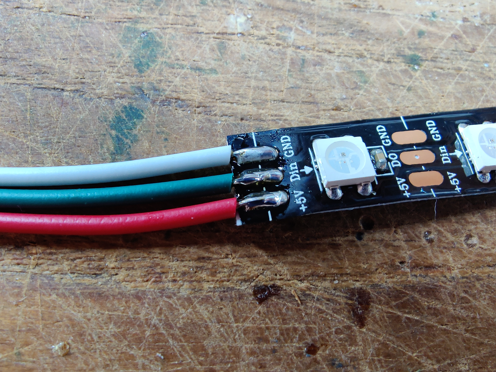

# Assembly
## Bausatz

1. Gehäuse mit Deckel
2. Inbus Zylinderkopfschrauben M3 5 mm
3. Verbindungsleitungen Schwarz, Rot 4,5 cm
4. Hohlsteckerbuchse mit Schraubklemme
5. WEMOS D1 mini
6. Pegelwandler (optional)
7. Steckernetzteil 4 A
8. LED-Stripes WS2812 (15 LEDs)
9. LED-Lichterkette WS2811 (10 LEDs - Mit In- und Out-Markierung)
10. Anschlusskabel Stripes mit Buchse
11. Anschlusskabel Stripes mit Stecker

## Benötigtes Werkzeug
1. Inbusschlüssel 2,5
2. Kleiner Schraubenzieher (z. B. Phasenprüfer)
3. Seitenschneider
4. Abisolierzange (optional)
5. Lötkolben etc.
6. Micro-USB-Kabel

## Anleitung Zusammenbau

Am Anschlusskabel mit Stecker die rote und die weiße Leitung um 1 cm kürzen, abisolieren und verzinnen.

Die rote und die schwarze Leitung abisolieren und verzinnen. Auf einer Seite ein wenig mehr abisolieren als auf den Bildern.

Die schwarze Leitung am WEMOS D1 mini an G anlöten, die rote Leitung an 5V und die grüne Leitung vom Anschlusskabel an D4.

Die rote Leitung mit der roten Leitung des Anschlusskabels verlöten. und die Schwarze Leitung mit der weißen Leitung des Anschlusskabels verlöten und anschließend in den Schraubklemmen festziehen.

Das ganze ins Gehäuse einsetzen.

Deckel drauf und verschrauben.

Nun das Anschlusskabel mit Buchse an die LED-Stripes löten.
Weiß an GND, Grün an Din und Rot an +5V.

LED-Stripes und Steuerung verbinden.

Optional kann jetzt noch die Lichterkette mit dem Stripe verlötet werden.
Das ist aber ziemlich dumm, weil die Ansteuerung unterschiedlich ist und dann die Farben dann nicht stimmen. (RGB/GRB)

